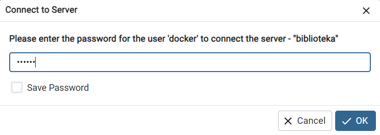
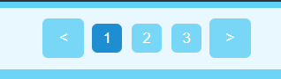

# BiblioSoils

## Spis treści
* Wstęp
* Prototypy
* Konfiguracja kontenerów
* Konfiguracja bazy danych
    * Logowanie do pgAdmin
    * Import danych
    * Struktura danych (Diagram ERD)
* Aplikacja i funkcje
  * Strona startowa
  * Strona rejestracji
  * Strona logowania
  * Strona katalogu książek
  * Strona szczegółów książki

## Wstęp
Repozytorium zawiera wykonanie projektu o nazwie "BiblioSolis". Projekt wykonany w ramach przedmiotu "Wstęp do Projektowania Aplikacji Internetowych".
BiblioSolis to aplikacja internetowa służąca do rezerwowania książek w celu późniejszego wypożyczenia ich fizycznie w bibliotece

## Prototypy
Przed przedstawieniem prototypów chciałbym powiedzieć, iź różnią się one nieco od finalnego wyglądu, wraz z tworzeniem aplikacji poznawałem nowe funkcje oraz sposoby stylizacji strony i w rezultacie wygląd na bieżąco ewoluował.
### Widok startowy

### Widok startowy, wersja mobilna

### Widok rejestracji

### Widok rejestracji, wersja mobilna

### Widok logowania

### Widok logowania, wersja mobilna

### Widok katalogu książek

### Widok katalogu książek, wersja mobilna

### Widok katalogu książek, wersja mobilna z rozwiniętym menu bocznym

### Widok szczegółów książki

### Widok szczegółów książki, wersja mobilna

### Widok szczegółów książki, wersja mobilna z rozwiniętym menu bocznym

## Konfiguracja kontenerów
### konfiguracja przez Docker Desktop
Po pobraniu kodu z repozytorium uruchamiamy program Docker Desktop, wybieramy opcję "Terminal" w prawym dolnym rogu i przechodzimy do katalogu aplikacji w którym znajduje się plik "docker-compose.yml".
Następnie wpisujemy komendę "Docker compose up".
### konfiguracja przez PHPStorm
Po pobraniu kodu z repozytorium otwieramy projekt aplikacji w programie PHPStorm, wybieramy opcję "Terminal" i wpisujemy komendę "Docker compose up".

## Konfiguracja bazy danych
### Logowanie do pgAdmin
W ramach kontenerów Docker tworzona jest lokalna baza danych Postgres oraz menedżer pgAdmin do zarządzania bazą.
Aby zalogować się do pgAdmin należy wejść na stronę localhost:5050, następnie wpisać dane logowania:
* login: admin@admin.com
* password: admin
  
(Uwaga, pgAdmin może nie ładować się natychmiastowo, strona powinna działać około minuty lub dwóch po uruchomieniu kontenera)

Po zalogowaniu wyieramy opcję "Add New Server", na pierwszej stronie nadajemy mu dowolną nazwę, następnie przechodzimy do zakładki Connection i wypełniamy następujące pola:
* Host name/address: db
* Port: 5432
* Maintenance database: db
* Username: docker
* Password: docker

Podczas łączenia się do bazy danych możemy zostać zapytani o podanie hasła. Wpisujemy "docker".

### Import danych
1. Zaznacza bazę danych na której wykonane mają być operacje.
2. Wybieramy pole otwarcia nowego zapytania.
3. kopiujemy całą zawartość pliku database.sql, który znajduje się w katalogu database i wklejamy do okienka zapytania.
4. Uruchamiamy cały skrypt.
5. Powinno pokazać się powiadomienie, że zapytanie zostało wykonane poprawnie.

### Struktura danych (Diagram ERD)

## Aplikacja i funkcje
### Strona startowa
Znajdując się na stronie startowej możemy jedynie przejść do strony logowania, bądź rejestracji.

### Strona rejestracji
Będąc na stronie startowej możemy zarejestrować nowego użytkownika, dane zapisywane są w bazie danych oraz automatycznie nowemu użytkownikowi nadawana jest rola user. Hasła są hashowane. Po rejestracji następuje przekierowanie na stronę logowania.

### Strona logowania
Zalogowanie następuje, jeżeli użytkownik istnieje w bazie danych i dane się zgadzają. po wprowadzeniu poprawnych danych następuje utworzenie nowej sesji i przekierowanie na stronę katalogu książek.
Na samym początku w bazie danych istnieją już dwaj użytkownicy:
* 
  * email: user@user.com
  * password: user
  * role: user

*
  * email: admin@admin.com
  * password: admin
  * role: user, admin

### Strona katalogu książek
Strona katalogu jest główną stroną aplikacji, to tutaj wyświetlane są wszystkie książki i tutaj użytkownik jest w stanie tworzyć i anulować rezerwacje, znajduje się tutaj szereg innych funkcjonalności, które omówię.

#### Rozwijane menu mobilne
znajdując się w widoku mobilnym jesteś w stanie kliknąć ikonkę hamburger menu po lewej stronie, aby otworzyć mobilną nawigacje.
 

#### Paginacja
Domyślnie na jednej stronie wyświetlane jest 10 książek, do obejrzenia kolejnych używamy strzałek paginacji. Strona na której obecnie się znajdujemy jest podświetlana ciemno niebieskim kolorem.
 

#### Sortowanie według kategorii
W pasku nawigacji możemy wybrać 4 z 5 dostępnych opcji sortowania książek (nie zaimplementowano opcji popularne, ponieważ jest to projekt uczelniany, bez faktycznych użytkowników, a wiec nie można sprawdzić jakie książki byłyby popularne).
Po wybraniu konkretnej opcji książki zostaną posortowane według tej kategorii.
 

#### Wyszukiwanie
Możemy wyszukiwać książki po tytule. Warto zaznaczyć, że wszystkie z teraz wymienionych trzech funkcji, to jest paginacja, sortowanie i wyszukiwanie, współgrają ze sobą, dzięki zastosowaniu ciasteczek (cookies). Możemy wyszukać książki według wybranego hasła, następnie posortować je po kategorii i, jeżeli zwrócono wystarczającą ilość rekordów, nawigować po nich przy pomocy paginacji.
 

#### Rezerwowanie
Jako użytkownik jesteśmy w stanie rezerwować interesujące nas książki, bądź anulować ich rezerwacje. Jeżeli książka została zarezerwowana przez innego użytkownika, to nie możemy jej rezerwować.
 

#### Panel użytkownika
Po kliknięciu ikonki użytkownika otwiera się panel użytkownik. Na ten moment dla kont z rolą user wyświetla się tam tylko opcja wylogowania.
Po wybraniu opcji "Wyloguj" usuwana jest sesja użytkownika oraz wszystkie ciasteczka i następuje przekierowanie na stronę startową.
 

#### Dodawanie książek
Jeżeli zalogowani jesteśmy na konto z rolą admin, to w panelu użytkownika pojawi się nowa opcja "Dodaj książkę".
 

 
Po wybraniu jej wyskoczy okno dodawania książki. Tytuł oraz okładkę wybieramy ręcznie, natomiast gatunek, wydawnictwo oraz autorów wybieramy z ograniczonej puli pobieranej z bazy danych. możemy wybrać więcej niż jednego autora.
 

 
Warto tutaj zwrócić uwagę na rozwijane menu autorów, jako, iż liczba autorów w bazie może wynosić bardzo wiele rekordów, to menu to zaopatrzone jest w pole wyszukiwania, dodatkowo każdy zaznaczony autor zapisywany jest w polu wyżej, aby widoczne było jakich autorów mamy już zaznaczonych
 

### Strona szczegółów książki
Strona ta zawiera informacje na temat konkretnej książki. Znajdują się tutaj te same funkcjonalności co na stronie katalogu, z wykluczeniem wyszukiwania.

